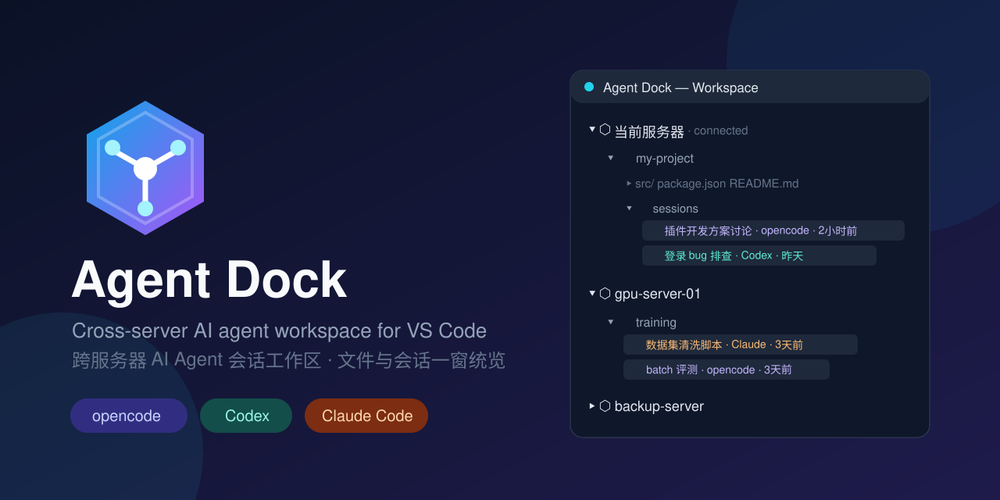
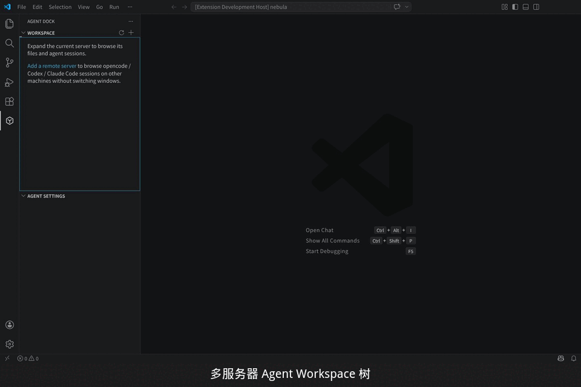
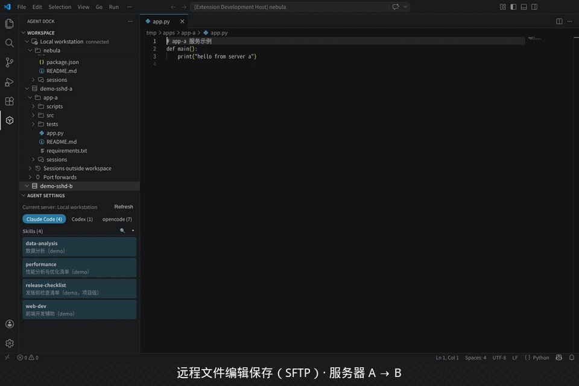
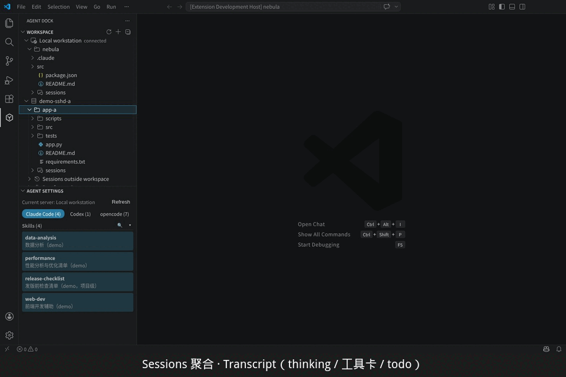
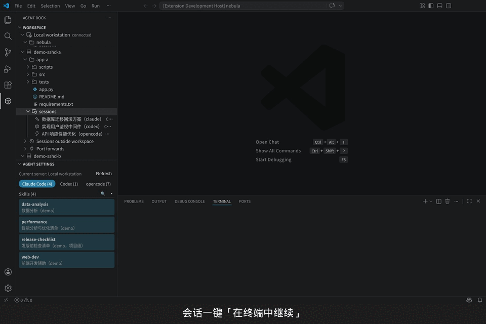
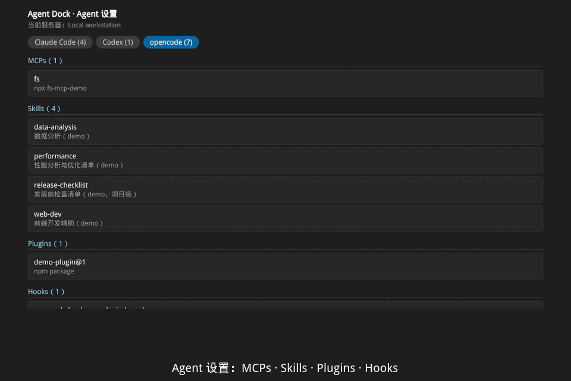

  
  <h1>Agent Dock</h1>
  
<strong>跨服务器 AI Agent 会话工作区</strong> · Cross-server AI agent workspace for VS Code

  

    
    
    
  

  

## 演示

| 功能 | 演示 |
|---|---|
| 多服务器工作区 |  |
| 远程文件编辑保存（SFTP） |  |
| Sessions · Transcript |  |
| 会话一键在终端继续 |  |
| Agent 设置：Skills / MCP |  |

---

一个窗口，统览多台服务器上的 AI 编程会话：VS Code 的 workspace 只能展示当前连接服务器的文件，Agent Dock 在此基础上把 **opencode / Codex CLI / Claude Code** 的历史会话按服务器聚合到同一棵树里——当前服务器看文件+会话，其他服务器只看会话，随时切换连接、恢复对话。

## 功能

- **统一 Workspace 树**（活动栏「Agent Dock」+ 内置「资源管理器」面板双入口，内容同步）
  - 当前服务器：workspace 目录的文件树 + `sessions` 子节点下的 agent 会话（目录 → sessions → 各会话）
  - 其他服务器：显式添加的目录及其会话，**并可懒加载浏览/编辑远程文件**（单层 `ls`、快照缓存、SFTP 可写保存，8 MiB 预览上限）；其余会话收进「其他目录会话」
  - 内置资源管理器中，含会话的目录显示 **AI 徽标**；文件节点有完整右键菜单（打开/复制路径/新建/重命名/删除/终端打开/从工作区移除，操作只刷新对应目录）
- **快照与刷新**：会话与远程目录列表持久化到磁盘——reload 后即刻显示上次快照，并按你的展开状态**定向自动重验证**（只刷新你打开的，不做全量）；手动 Refresh 强制全量重扫
- **添加目录**：路径浏览下拉框（输入 `/` 或 `~` 自动补全子目录，本地与远程一致），或「连接至其他服务器」→ ssh config 主机列表 → 选择远程目录固定到树中；操作与原生「将文件夹添加/移出工作区」完全同步
- **会话 Transcript**：结构化渲染——markdown 正文（marked + DOMPurify，VS Code 官方同款管线）、折叠 thinking、工具卡片（输入+输出配对）、todo 清单、文件变更、模型切换与子代理标记、子会话嵌套
- **用量与监控**：头部汇总行（模型 · in/out tokens · 缓存读写 · 费用 · skills 估算）；可展开的**会话监控面板**——每个 skill 的调用次数与估算 tokens（条形图对比）
- **连接与恢复**：右键服务器 Connect（当前窗口切换到该服务器，基于 Remote-SSH）；会话一键「在终端中继续」（`opencode --session` / `codex resume` / `claude --resume`）；目录右键「新建会话…」
- **不阻塞的远程操作**：慢服务器后台扫描（加载占位、完成自动刷新）；超过 3 秒的远程操作弹出可取消通知，Cancel 即终止；SSH 连接复用（ControlMaster），扫描/列目录/读文件并发上限 4 路
- **日志**：「Agent Dock」输出通道分级记录每次 SSH 调用耗时与结果、扫描统计与错误
- **Agent 设置**：按 agent 分组展示当前服务器的 MCPs / Skills / Plugins / Hooks（含项目级配置），分组可折叠、可筛选，点击打开对应配置文件
- **i18n**：English / 简体中文完整覆盖

## 使用

1. 安装打包好的 `.vsix`（VS Code 扩展面板 → `...` → Install from VSIX），或从 Marketplace 安装
2. 树标题栏「+」添加目录/服务器；服务器列表保存于客户端用户级 `settings.json` 的 `agentDock.servers`（**跨窗口、跨服务器一致**）

> 更新扩展后需 `Developer: Reload Window`。连接远程服务器需要 Remote-SSH 扩展与 ssh 密钥免密。

开发者编译/打包/测试流程见 [docs/dev.md](docs/dev.md)。

## 依赖

- 远程服务器：Linux + ssh（BatchMode）；建议装有 `python3`（最优扫描路径，缺失时回退 `sqlite3` CLI / 文件扫描）
- Connect 功能需要 `ms-vscode-remote.remote-ssh`

## 配置

| 配置项 | 默认 | 说明 |
|---|---|---|
| `agentDock.servers` | `[]` | `[{ name, host, user?, port?, folders[]? }]`；host 可为 `~/.ssh/config` 别名 |
| `agentDock.sessionLimit` | `100` | 每服务器每 agent 扫描会话上限 |
| `agentDock.connectInNewWindow` | `false` | Connect 是否新窗口打开 |
| `agentDock.sshTimeoutSeconds` | `20` | 单次 SSH 远程操作超时（秒，5–120） |
| `agentDock.sshConnectionPersist` | `8h` | SSH 主连接复用保持时长（`10m`/`8h`/`yes` 不限，`0` 禁用） |
| `agentDock.logLevel` | `info` | 「Agent Dock」输出通道日志级别（debug/info/warn/error） |

## License

MIT
